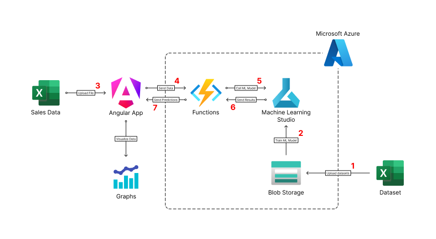
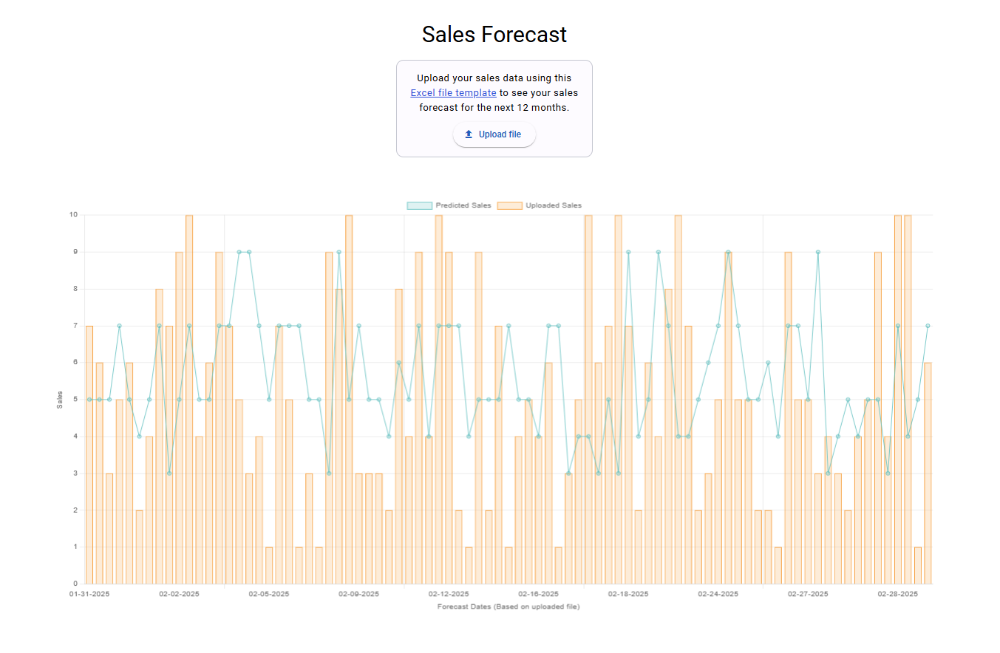

# Sales Forecast Web Application

This project showcases a web application developed using Azure technologies to predict sales based on uploaded Excel files. The application leverages Machine Learning, data processing, and visualization tools to provide insights into future sales trends.

## Table of Contents

1. [Project Overview](#project-overview)
2. [Technologies Used](#technologies-used)
3. [Features](#features)
4. [Setup Instructions](#setup-instructions)
5. [Usage](#usage)
6. [Project Structure](#project-structure)
7. [Contributing](#contributing)
8. [License](#license)
9. [Contact](#contact)

## Project Overview

This application allows users to upload an Excel file containing historical sales data, which is then processed to predict future sales quantities. The predictions are displayed in line and bar charts for easy visualization.

## Technologies Used

- **Microsoft Azure**: Machine Learning Studio, Blob Storage, Container Instance, Azure Functions
- **Angular**: For the frontend web application
- **Node.js**: Backend API via Azure Functions
- **Chart.js**: For data visualization
- **Python**: Data preprocessing and model training

## Features

- **Data Upload**: Users can upload Excel files containing sales data.
- **Data Processing**: The uploaded data is validated and processed using Azure Functions.
- **Machine Learning Model**: A Linear Regression model predicts transaction quantities.
- **Visualization**: The application displays both uploaded and predicted data in graphical formats.
- **Azure Integration**: Utilizes various Azure services for data storage, processing, and model deployment.

## Architecture



## Screenshots



## Setup Instructions

To run this project locally, follow these steps:

1. **Clone the repository**:

   ```bash
   git clone https://github.com/felixdelafuente/sales-forecast.git
   cd sales-forecast
   ```

2. **Frontend Setup**:

   - Install Angular CLI if not already installed:
     ```bash
     npm install -g @angular/cli
     ```
   - Navigate to the `frontend` directory and install dependencies:
     ```bash
     cd ../frontend
     npm install
     ```

3. **Running the Application**:
   - Start the frontend development server:
     ```bash
     cd ../frontend
     ng serve
     ```
   - Visit `http://localhost:4200` to view the application.

## Usage

1. Upload an Excel file containing sales data.
2. The backend API processes the file and uses the ML model to predict future sales.
3. View the uploaded and predicted sales data in line and bar charts.

## Project Structure

- **sales-forecast/**: Contains the Angular application for the user interface.

Note: The backend API is in Azure Functions and the ML model is deployed in the cloud.

## Contributing

This project is a personal portfolio project and is not open for contributions. However, if you have any suggestions, feedback, or questions, feel free to reach out. Your insights are always appreciated!

## License

This project is licensed under the MIT License - see the [LICENSE](LICENSE) file for details.

## Contact

For questions or inquiries, please reach out to me at felixjerome.delafuente@gmail.com or any of my socials below.

[](https://felixdelafuente.github.io/me/)
[](https://github.com/felixdelafuente)
[](https://www.linkedin.com/in/delafuentefelix/)
[](https://www.facebook.com/felixdelafuente.dev)
[](https://x.com/delafuentefelix)
[](https://www.threads.net/@fj.pdf)
